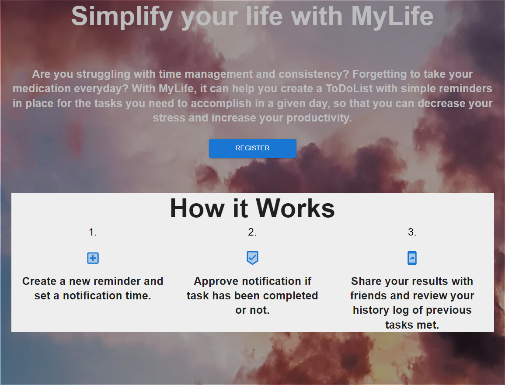
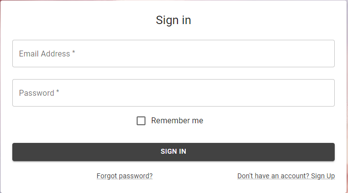

# MyLife

## Overview
MyLife is a lifestyle application that sends reminders to a user based on the tasks they have set in the settings. These tasks can be anything from drinking 8 glasses of water a day to having your medications. Unlike other apps the reminders will be broken up into small manageable tasks from your initial large tasks. For example if a user wants to drink 8 glasses of water, from the sleep schedule of the person there would be 16 hours in a day. Since the user specifies in the settings that they don’t want any notifications after 10, if they wake up at 6, they will get a notification every 2 hours to drink a glass of water. This can also be done for eating food, medications, any any other tasks they input. 

Note: the reminders would be specific to the task. Other functionality includes collaborators, tracking of progress, styling, and enviornmental notificaitons.

## User Story
```
AS A person struggling with time management and consistency, 
I WANT to create a todolist with simple reminders in place for the tasks I need to accomplish in a given day, 
SO THAT I can decrease my stress and increase my productivity.
```

# Preview

Home Page:
<p>


Sign In Page:
<p>


Sign Up Page:
<p>


# Links

- [Repo](https://github.com/ccaitano/my-life)
- [Heroku](https://my-life-premium.herokuapp.com/)


# Technology

- [JavaScript](https://www.javascript.com/)
- [Node](https://nodejs.org/en/)
- [npm](https://www.npmjs.com/)
- [Express](https://expressjs.com/)
- [MongoDB](https://www.mongodb.com/)
- [React](https://reactjs.org/)
- [Heroku](https://www.heroku.com/)
- [Material UI](https://mui.com/)
- [Magicbell](https://www.magicbell.com/)
- [Chartjs](https://www.chartjs.org/)

# Credits

- [Bjorn Addington](https://github.com/Franswarduvar)
- [Cheryl Caitano](https://github.com/ccaitano)
- [Sterling Carfrae](https://github.com/scarfrae)
- [Ryan Merced](https://github.com/ryanmerced)


# License

MIT License

Copyright &copy; 2022 Bjorn Addington, Cheryl Caitano, Sterling Carfrae and Ryan Merced

Permission is hereby granted, free of charge, to any person obtaining a copy
of this software and associated documentation files (the "Software"), to deal
in the Software without restriction, including without limitation the rights
to use, copy, modify, merge, publish, distribute, sublicense, and/or sell
copies of the Software, and to permit persons to whom the Software is
furnished to do so, subject to the following conditions:

The above copyright notice and this permission notice shall be included in all
copies or substantial portions of the Software.

THE SOFTWARE IS PROVIDED "AS IS", WITHOUT WARRANTY OF ANY KIND, EXPRESS OR
IMPLIED, INCLUDING BUT NOT LIMITED TO THE WARRANTIES OF MERCHANTABILITY,
FITNESS FOR A PARTICULAR PURPOSE AND NONINFRINGEMENT. IN NO EVENT SHALL THE
AUTHORS OR COPYRIGHT HOLDERS BE LIABLE FOR ANY CLAIM, DAMAGES OR OTHER
LIABILITY, WHETHER IN AN ACTION OF CONTRACT, TORT OR OTHERWISE, ARISING FROM,
OUT OF OR IN CONNECTION WITH THE SOFTWARE OR THE USE OR OTHER DEALINGS IN THE
SOFTWARE.